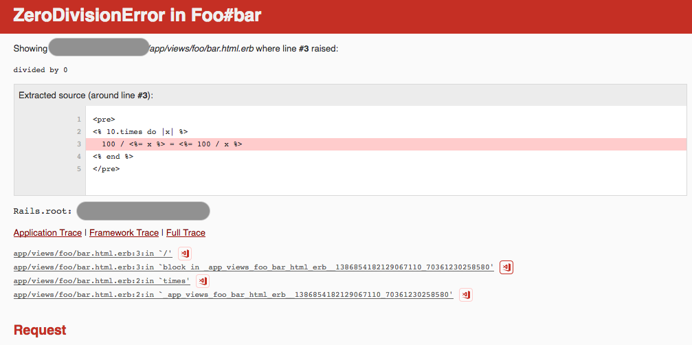
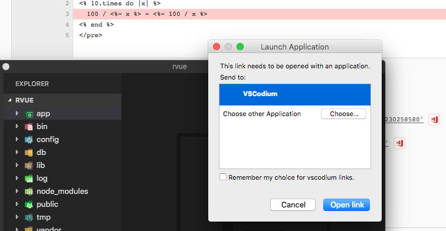
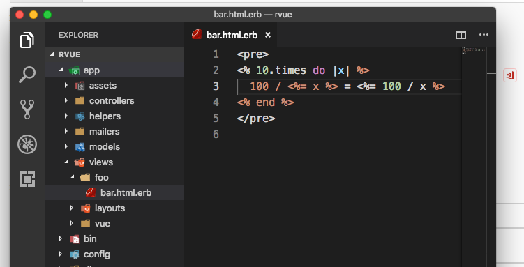
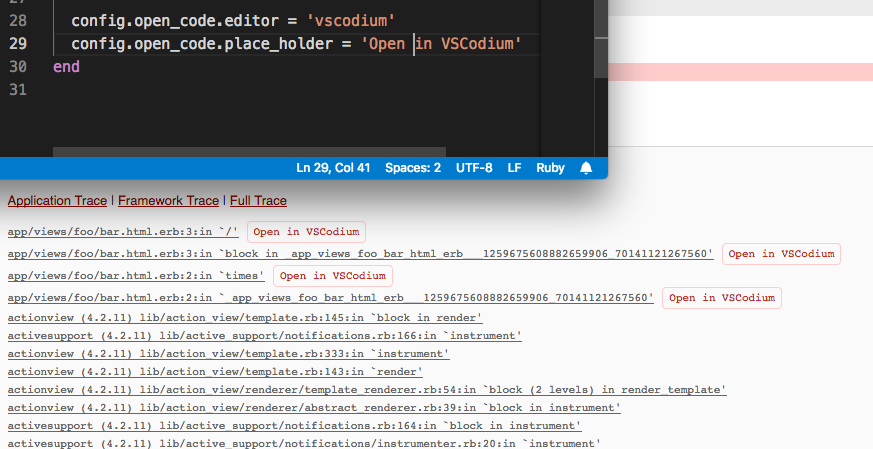

# OpenCode::Rails

[](https://travis-ci.com/eGust/open_code-rails)

Add links in exception page to open Application Trace file to line in VSCode. Now only support [VSCode](https://code.visualstudio.com/) or [VSCodium](https://github.com/VSCodium/vscodium).

- Show VSCode icons
    
- Click to open vscode/vscodium
    
- Open file to line
    
- Custom Settings and Full Trace
    

## Installation

Add following to your Rails `Gemfile`:

```ruby
group :development do
  gem 'open_code-rails'
end
```

## How it works

VSCode supports [Opening VS Code with URLs](https://code.visualstudio.com/docs/editor/command-line#_opening-vs-code-with-urls).

This gem simply inject some CSS and JS to HTML response while status is 500. Your browser will parse DOM and generate new links.

## Configuration

### Basic - in config file

You should put settings in `config/environments/development.rb` because this gem should only work in dev server. It will prevent production server starting up.

1. `config.open_code.editor` - default: `'vscode'`

    Currently only support `'vscode'` and `'vscodium'`. It will be used to link's scheme part, like `vscode://` or `vscodium://`. You can set it any string but probably won't work, unless your editor supports `<scheme>://file/<absolute file path>`.

    Set to `false`, `'off'` or `'disabled'` to disable this gem

    ```ruby
    # config/environments/development.rb
    Rails.application.configure do
      config.open_code.editor = 'vscodium'
    end
    ```

2. `config.open_code.place_holder` - default: `''` (blank)

    Leave it blank will display links as VSCode icon. If you set it to a string, it will display text rather than icon. In case your browser does not support SVG Data URI in CSS, or you don't like the icon.

    ```ruby
    # config/environments/development.rb
    Rails.application.configure do
      config.open_code.place_holder = 'Open in VSCodium'
    end
    ```

3. `config.open_code.root_dir` - default: `::Rails.root`

    The absolute path of your Rails project folder. Sometimes you may run dev server remotely, so you need to set it to your local path.

    ```ruby
    # config/environments/development.rb
    Rails.application.configure do
      config.open_code.editor = '/Users/MyName/projects'
    end
    ```

### Advanced - via Environment Variables

Some flexibility is probably required for cooperation. Different people may have various preferences of IDE/editors, also the folder could be placed differently. So here you go.

1. `FORCE_OPEN_CODE_EDITOR`

    When is not blank, `config.open_code.editor` will be overridden.

    Set to `false`, `off` or `disabled` to disable the gem

        $ /usr/bin/env FORCE_OPEN_CODE_EDITOR=off rails s

2. `FORCE_OPEN_CODE_PLACE_HOLDER`

    When is not blank, `config.open_code.place_holder` will be overridden.

        $ /usr/bin/env FORCE_OPEN_CODE_PLACE_HOLDER='Open in VSCodium' rails s

3. `FORCE_OPEN_CODE_ROOT_DIR`

    When is not blank, `config.open_code.root_dir` will be overridden.

        $ /usr/bin/env FORCE_OPEN_CODE_ROOT_DIR='/my/project/path' rails s
